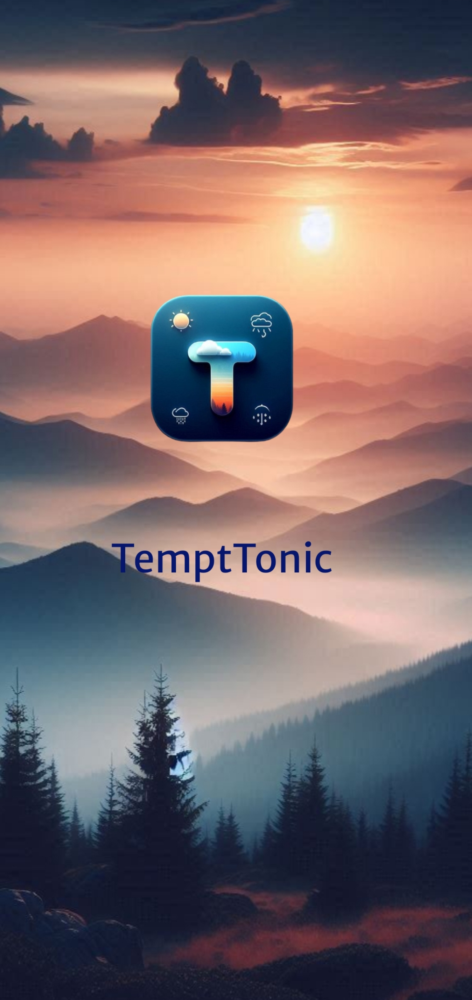
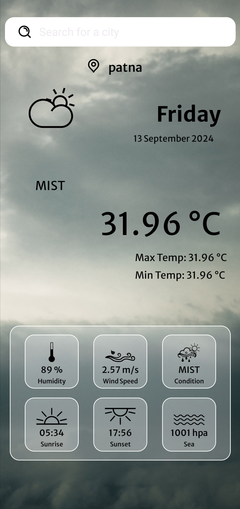
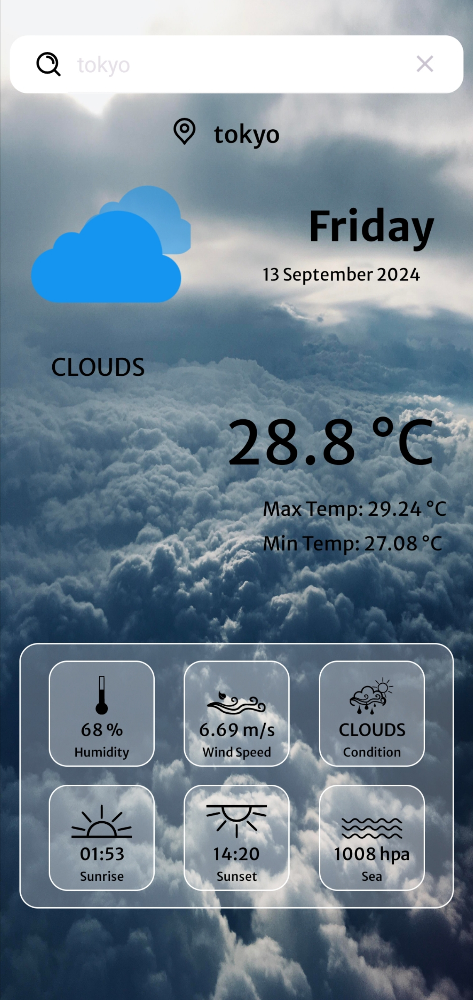

# Screenshots

This folder contains screenshots of the TemptTonic app for UI demonstration and documentation purposes. Each image provides a visual preview of different sections and features of the app.

## Screenshots

### Splash Screen

- **Description**: The initial screen that appears when the app is launched.

### Home Screen (Weather in Patna)

- **Description**: Displays the weather information for Patna, including current temperature, humidity, and other details.

### Current Weather Display (Tokyo)

- **Description**: Shows the current weather conditions for Tokyo, with dynamic background and weather details.

Each image provides a visual preview of different sections and features of the TemptTonic app. For detailed information on how to use the app, please refer to the main `README.md` file located in the root directory of the repository.

